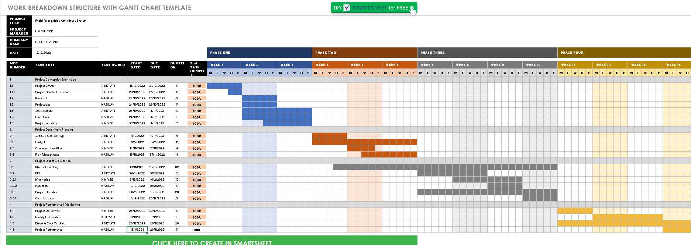
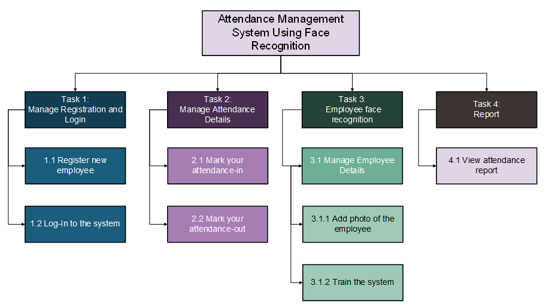

# PROJECT OVERVIEW
## B. PLANNING THE PROJECT

### Project Management Life cycle

The project management life cycle is represented and documented in the form of Gantt Chart which allows QTMT staff to follow the guidelines and achieved the milestone from time to time. The project life cycle WBS breakdown the task and work of every members such as project manager into several modules. Every member have their own roles and part in every stage of the lifecyle based on the constructed WBS.

Project management WBS is shown in the Gantt Chart below from Week 1 to 14:

As for the Attendance Management Project, the system WBS are represented as follow. This WBS is constructured to breakdown the technical part of the project into several modules such as interface design, API management, Facial Detection and Facial Recognition: 

### Scope
A work breakdown structure (WBS) is created to map all the necessary tasks and develop the process which the WBS will be maintained and approved.

The system mainly works around 2 types of users

1. Employee
2. Admin

Following functionalities can be performed by the admin:
- Login
- Register new employees to the system
- Add employee photos to the training data set
- Train the model
- View attendance report of all employees. Attendance can be filtered by date or employee.

Following functionalities can be performed by the employee:
- Login
- Mark his/her time-in and time-out by scanning their face
- View attendance report of self
  
 
### Risk Identification Chart (Quality, Cost, Time)

| Control Element | What is likely to go wrong? | How and when will I know? | What will I do about it? |
|-----|----|-------|-----|
|Quality   (Poor attitude toward quality; substandard design, materials, and workmanship; inadequate quality assurance program)|1. Inadequate Quality Assurance Program: The system confused similar faces.    2. Inadequate Quality Assurance Program: The quality of the AI model is biased towards a certain race or skin color.  |How: The output result always mismatch the face to the user or does not detect a face at all.     When: The quality problem of will be determined during the unit testing phase|Assign one member to keep on collecting the data day to day and increased the dataset until a satisfied result is determined.|
|Cost   (Estimating errors; inadequate productivity, cost, change, or contingency)|1. Contigency: The costing of the server runtime is high if left connected and unattended.    2. Inadequate productivity: Team members working from home will generate longer server uptime which will increase cost. |How: The monthly bills shows unexpected extra charged to the bills.  When: The problem most probably will be encountered during the project execution and project implementation.|Notify the owner if server runtime exceeds certain amount of hours.
|Time   (Errors in estimating time or resource availability; errors in determining the critical path; poor allocation and management of float; early release of competitive products) | 1. Project not able to reach the milestone set in the Gantt Chart.    2. Erros in estimating resource availability: Server overload and does not have enough capacity to train the model.  |How: Member(s) could not complete the task and did not inform during progress meetings    When: The problem will be encountered during the project excution and monitoring phase.| Encourage members to be open on their issues regarding the project and discuss it during meetings.|

### Responsibility Assignment Matrices (RAM)

 

|Roles|
 Person In Charge 
|Responsibilities|
|:-----:|:------:|------|
| Project Manager | LIM XIN YEE |The Project Manager is accountable to the Project Director for all the project office management related activities. The Project Manager plans, guides, and oversees the day-to-day internal activities that support the Project Office, and assists in the development of the master project schedule and all other project work plans. Attendance Management Using Face Recognition Project will need the project manager to identify who we can propose our idea to and who are probably going to accept our idea. Project Manager also need to check and make sure all the initiation and planning documents such as Work Breakdown Structure (WBS) and Gantt chart are constructed in a clear and complete form.    The Project Manager is accountable for the development, maintenance, and adherence to the Project Office infrastructure and supporting methodologies (e.g. processes, procedures, standards, and templates) that are in compliance with OSI Best Practices and policies. Attendance Management Using Face Recognition Project also needs to keep on monitor the project in making sure that the progress follows the project scope and requirement. The project manager needs to work on the corrective action if any problem occur.|
| Procurement Manager | NURFATIN NABILAH | The Procurement Manager oversees and manages the generation of the RFP or RFO and other solicitation documents. Other areas of the project office may be assigned responsibility for specific sections, but the Procurement Manager is responsible for integrating all the pieces and ensuring consistency and continuity throughout the entire procurement process and conforming to procurement standards, rules, and regulations. This includes managing the RFP or RFO development, preparing and maintaining procurement schedule, coordinating contract negotiations and managing evaluation of proposals or offers and selection of vendor.    The procurement manager needs to negotiate the contract, policies and deadlines of the project with each of the members. Moreover, procurement manager needs to ensure that no staff can buy any stuffs related using company’s money. Every expense needs to be approved by procurement manager.
| Risk Manager | NURUL AZIEYATI | The Risk Manager is responsible for managing and tracking risks and risk mitigation/contingencies on the project. The Risk Manager also monitors prime contractor risk management efforts to ensure they do not adversely impact the project. The Risk Manager manages and tracks potential and active risks, maintain the risk management tool and documentation information, leads risk identification sessions for the project, monitors prime contractor risk management efforts, and participates in division-level risk management activities for risks that cross project boundaries or are beyond the project's control.    Any risk in this project need to be listed out.    Every step in this project might have unexpected problems. Hence the risk manager is required to list out every single risks so that they can avoid and take precaution to make sure that particular problem will not happen.
| Administrative Manager | LIM XIN YEE | The Administrative Manager The Administrative Manager directs the administrative staff, coordinates tools and services training, ensures that the administrative staff adhere to processes and policies, leads the cost management effort including: sponsoring cost budgeting and tracking activities, facilitating communication on fiscal status, and ensuring the project cost tool and supporting documentation is maintained. The Administrative Manager also provides reports, recommendations, and status on the project budget and expenditures, e.g., planned vs. actual reports, initiates corrective action, and re-planning activities.    After each process in attendance management using face recognition project, the administrative manager needs to list out every possible thing that can be presented in the documentation form. For example, the activity report, and any documentation related to cost. This role is very important to make sure everyone and everything works under a standard procedure according to the documentation, and also avoid wastage in terms of time and money.|
| Financial Analyst | NURUL AZIEYATI | The Financial Analyst is responsible for supporting the Administrative Manager by managing and tracking Attendance Management using Face Recognition project budget/costs, coordinating/preparing budgetary documents, e.g., Special Project Reports and OSI Budget Change Proposals, reviewing budget/contract expenditures, and collecting and our reporting financial metrics. This includes reconciling the accounting and Work Breakdown Structure cost management processes and developing financial management policies and procedures.   The Financial Analyst also provides support in project solicitations, evaluations, and award processes - assisting in the evaluation of the cost and administrative sections of the proposals based on the criteria in the Evaluation Plan.   Next, financial analyst’s main role is to pore over data to identify the opportunities and evaluate the outcomes for this attendance management using face recognition system.|
| Project Scheduler | LIM XIN YEE | The Project Scheduler’s role is to coordinate and manage inputs to the plan includes tracking progress against project schedule, merging and identifying dependencies and risks between the project schedule, tracking progress on prime contractor's schedule and counties' schedules.   In short, the Project Scheduler’s work is to design the progress flow and tracking on it in order to prevent the development progress of system out of control, and also prevent unexpected risk caused by delay/interruption on progress. |
| Quality Manager | NURFATIN NABILAH | The Quality Manager is responsible for overseeing and ensuring the attendance manager using face recognition system and the quality as well as for the Prime Contractor. The Quality Manager provides insight into the project and contractor methods of doing business by reviewing process and product activities for adherence to standards and plans.   Quality manager is very important in our project as he/she need to examine all of the quality of the system and evaluate the final output so that the system can produce the output which is recognize the face accurately without silly mistakes. Finally, quality manager will conduct a report to upper management such as project manager on the quality standard issues so that improvement can be done on to the project.|
| Stakeholder Coordinator | LIM XIN YEE | The Stakeholder Coordinator acts as the principle liaison between the stakeholders and the Project Office to ensure successful implementation and ongoing maintenance of the Attendance Management using Face Recognition system.   In addition to overseeing critical ongoing stakeholder communication, the Coordinator manages stakeholder-related issues and ensures timely resolution. The Coordinator manages stakeholder issues by developing and maintaining the portion of Issue and Escalation Process that affects the stakeholders. The Stakeholder Coordinator communicates risks and issues to the affected stakeholders in report and meetings. Stakeholder Coordinator coordinates stakeholder schedules for Project planning and implementation activities in conjunction with the Project schedule.   In this role, a stakeholder's sensitive information has to be secure and only accessible by the key person in the project. The stakeholder coordinator need to give priority to those that are important to us and try to make sure they invest or support our project.|
| Technical Manager | NURFATIN NABILAH | The Technical Manager is responsible for the day-to-day activities of state and vendor technical staff who are engaged in the technical management aspects of the project. The technical manager and system engineer will co-lead in the technical disciplines of the project partially but not go through the whole project.    Technical Manager’s work is to partner with other IT managers to acquire appropriate technical assistance for such areas as enterprise architecture, database, software development, security, testing, configuration management, change management, release management, and other technical areas of the new system. The Technical Manager will act with the system engineer to provide leadership and support to technical staff that are augmented to the project throughout the project life cycle.   Other than that, the Technical Manager also in charge to provide technical support to the Project Director, Project Manager, and other managers in the Project Office to establish and execute technical policies, processes, and procedures. |
| Implementation Manager | NURUL AZIEYATI | The Implementation Manager will be responsible for the implementation portion of the project by providing implementation management leadership through planning, organizing, coordinating, and monitoring implementation activities. In addition, the Implementation Manager need to manage all information technology resources assigned by the project manager including implementation strategy, organizational change management, production support, IT training, defect or problem tracking, and Maintenance & Operation. The Implementation Manager will coordinate SOWs and interface directly with contractors to ensure technical obligations satisfy all objectives and expectations.   The role of Implementation Manager in the project of will be like the intermediate between the project leader and system developer to achieve connection between them, include transferring instruction from manager and help in managing the developer’s work. |
| Test Manager | LIM XIN YEE | The Test Manager is responsible for coordinating the testing of the Prime Contractor's system. The Manager works with the Quality Management staff to design test cases and data that will best represent "real-life" scenarios for the system. The Test Manager is also responsible for coordinating interface tests with other organizations (county, state, federal), as needed. They plan, monitor, and evaluate prime contractor test plans, problem reporting and resolution process.   In this project, they will play the role to plan on testing on the system then report issues to developer I order to improve the system. It is important for this task to prevent confusion or accidents after releasing it, that will be causing big trouble for the development team and also the company, the worst case is that it will end up the whole team future. |
| Operations Manager | NURFATIN NABILAH | The Operations Manager is responsible for coordinating and overseeing the operations of the new system. Any resolutions for problems that are faced during the whole project need to be approved by operation Manager. For example, when they are facing problem on extracting the face from an image, operation Manager has the power to determine what action to be taken, whether improve the system in terms of the hardware, or software. Not only that, administration and operation activities also falls under the responsibilities of operation Manager. The operation manager for attendance management using face recognition project has the responsibilities to make sure everyone from the team is carrying out their work properly.|
| Customer Support Manager | NURUL AZIEYATI | The Customer Support Manager is responsible for overseeing the M&O Contractor service efforts, and assisting the customer with special requests or problems. The Customer Support Manager provides customer perspective and problem prioritization, monitors contractor service levels and metrics.   The support manager of this project have to help customer in answer the question and faq through email, phone and also social media chat. This role of this is very important as it will make customer feel friendly and important.|
| Executive Steering Committee | LIM XIN YEE | The Executive Steering Committee acts as the Project stakeholders group, ensuring that the deliverables and functionality of the project are achieved as defined in the project initiation documents and subsequent project management plans. This committee provides high-level project direction, receives project status updates, and addresses and resolves issues, risks, or change requests.   Furthermore, Executive Steering Committee needs to make decisions concerning our financial management of the project. He measure the progress against the specific objectives, milestones and deliverables of each work page. |
| Office of Technology Services (OTech) Representative | NURFATIN NABILAH | The OTech Representative acts as the liaison between the Project Office and the OTech in defining required services, assisting the project in determining the feasibility of services, cost estimates, planning, and other technical assistance to aid the project in making informed data center decisions.  This role is important as its will help our company to determine which technology and stack is important. After determine the technology stack and requirement, we can only check the risk management and assessibility. Therefore, OTech is very important to make sure correct technology stack and cost in a company. |

   
##### Next: [Project Implementation](C-PROJECT_IMPLEMENTATION.md)

 
