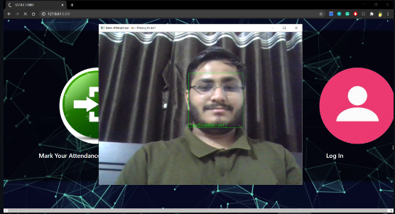
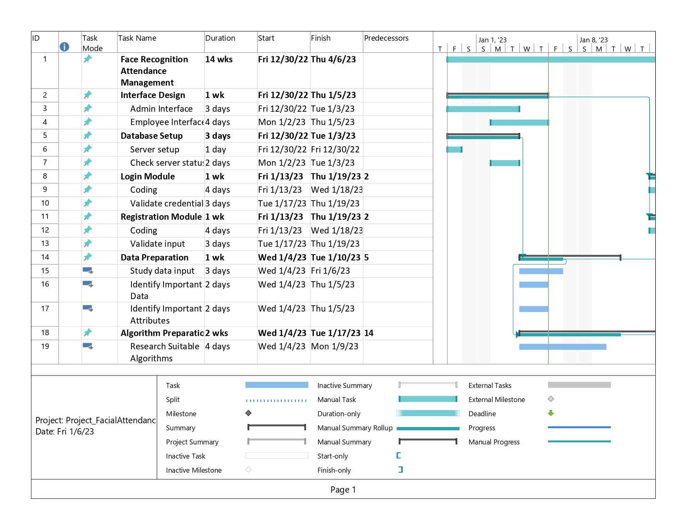

# PROJECT OVERVIEW

## C. IMPLEMENTING THE PROJECT PLAN
### Deliverables:
Hardware Requirement:
For the hardware, our group uses the laptop which consists of intel core i5 and 8GB RAM to conduct our project.

#### Software Requirement:
For the software, our group used python programming language to implement the code for intelligent module in recognizing face and PHP programming language to design the website and database connection. 

#### Intelligent System Architecture:
The proposed of the system uses the Dlib's HOG facial detector using CNN and Linear SVM (scikit-learn) for Face detector and to pre-trained the model.

#### Outcomes of the system
4 main steps will be applied in our system, which is face detection,facial landmark detection, extraction of facial embeddings and classification of unknown embedding. This system mainly works for 2 types of users which is for admin and employee. As for the admin page, it has several modules which are login module, register new employees to the system module, add employee photos to the training data set, train the model and view attendance report of all employees. The attendance can be filtered by date or employee. Next is the functionalities that can be performed by the employee. As for employee page, there is login module, marking his/her time-in and time-out by scanning their face and viewing attendance report of their own.

### Tasks and Estimated Costs

| Task |  Estimated Costs | Notes |
|-----|----|----|
|   Server Maintenance         |$1800                         |  Monthly Cloud Server      |      
|   Construction supervision   |$15000                         | Supervision on the project | 
|   Cultural resources         |$72000                         |  Investigate and evaluate undertaking                                                 |                              |
|   Equipment and equipment use|$5000                           | Equipment preparation and setup                                                       |                              |
|   Project signs              |$400                           |  Installation of project signs     |                            |
|   TOTAL                      |$94200                        |  Estimated     |                              |

### Milestone Chart
Figures below shows the milestones for the development phase of the project, the subtasks are the modules needed to complete the development of the project.
#### Microsoft Project:

   
##### Next: [Project Execution](D-PROJECT_EXECUTION.md)
