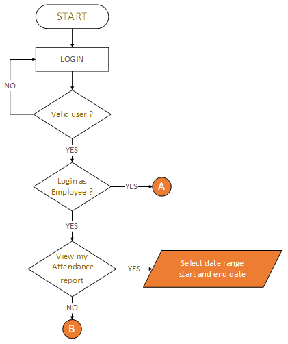
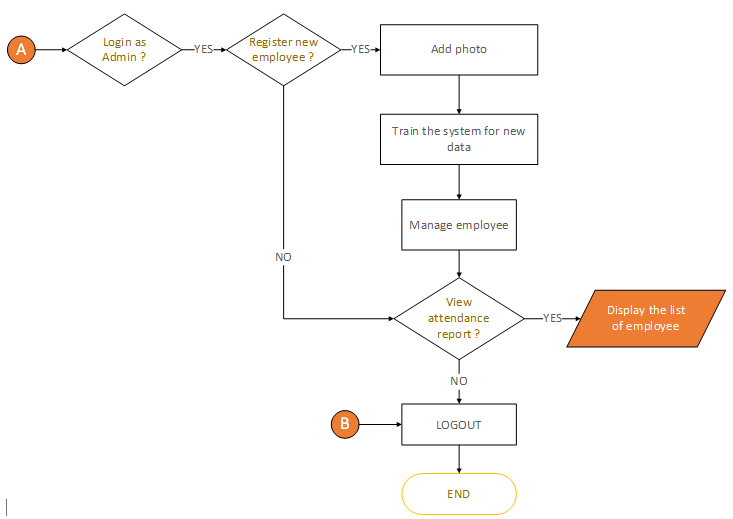

# PROJECT OVERVIEW
## D. EXECUTING THE PROJECT
### Project Design and Coding
Entity Relationship Diagram:
 

Flowchart:
 

### Description of the project coding and implementation
Libraries and Packages required:

Car Plate Detection: 
This new implementation has an additional function username_present(username), which checks if a user with the provided username exists in the database or not by using User.objects.filter(username=username).exists(). User.objects.filter(username=username) will return all the user object which has the given username, and .exists() method checks if any object is returned or not. This function is useful as it checks if the user with the given username is present in the database before creating a directory. It eliminates the case where a user may be trying to create a directory for a non-existing user. The create_dataset function is still creating a directory with given username if it does not exists. Now it can be used in the way like :
 

This code appears to be setting up a facial detection and alignment system using the dlib library. The following operations are done in the code below:

1. "Loading the facial detector" - The dlib.get_frontal_face_detector() function is called to load a pre-trained model for detecting faces in an image.

2. The dlib.shape_predictor() function is used to load a pre-trained model for predicting the 68 facial landmarks. The shape_predictor_68_face_landmarks.dat file is passed as an argument, which contains the trained model data.

3. FaceAligner class is initialised with given predictor and desired face width.

4. "Initializing Video stream" - The VideoStream class is imported and initialized to start capturing images from the webcam using the start() method. The src parameter is set to 0, which is the default camera index and refers to the built-in webcam.

The facial detector is used to detect faces in the images captured from the webcam, and the facial landmarks predictor is used to align the faces in the images. The FaceAligner class aligns the face using facial landmarks.
 

In this step, the function below takes two inputs, embedded and targets, which are used to create the visualization. The TSNE class from the sklearn.manifold library is used to transform the data in embedded into a 2-dimensional space. Then, the function enumerates through the unique elements of the targets input, and uses this to index the transformed data X_embedded. A scatter plot is created, with the points in the scatter plot corresponding to the elements of X_embedded indexed by targets == t. Each class from the targets is assigned a different color and a label. Lastly, the visualization created is saved as an image using plt.savefig('./recognition/static/recognition/img/training_visualisation.png'), and close the figure to free up resources. Also autolayout is set to True to ensure that the figure is tight and the labels are visible.
 

The function below takes an input, present, which is a dictionary that maps user names to Boolean values indicating whether the user is present or not. The function then starts by getting the current date and time using datetime.date.today() and datetime.datetime.now() respectively. Then, it iterates through the present dictionary, getting the user object corresponding to the username using User.objects.get(username=person). Then it tries to get the Present model object, which contains the attendance record of a user and by calling Present.objects.get(user=user,date=today). If the object does not exist, it creates a new Present object and sets the user and date fields to the user and today's date, respectively and set the present field according to the dictionary, then it save this object. If the object already exists, it updates the present field of that object, then it saves the updated object. Lastly, it also saves a new Time object, and set the user, date, time and out fields, if the user is present that day.
 

This function is similar to the previous one and is used to update the attendance records of users when they are logging out. 
 

### Project Result
Employee and Admin Interface:

Facial Recognition Module

   
##### Next: [Project Closing](E-PROJECT_CLOSING.md)

