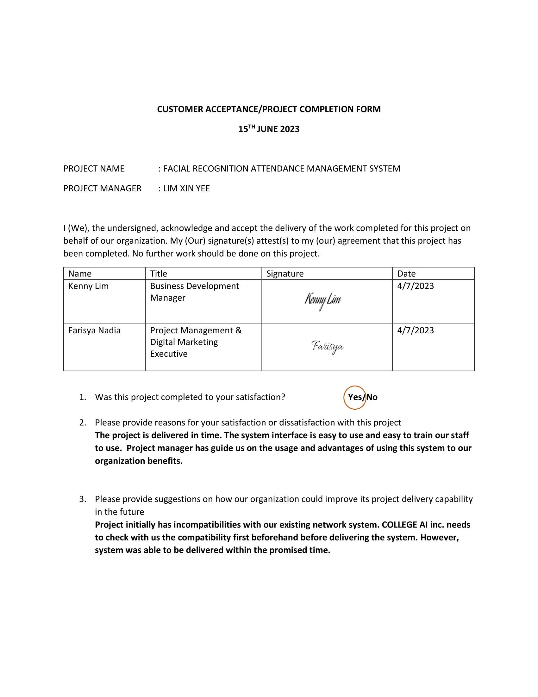
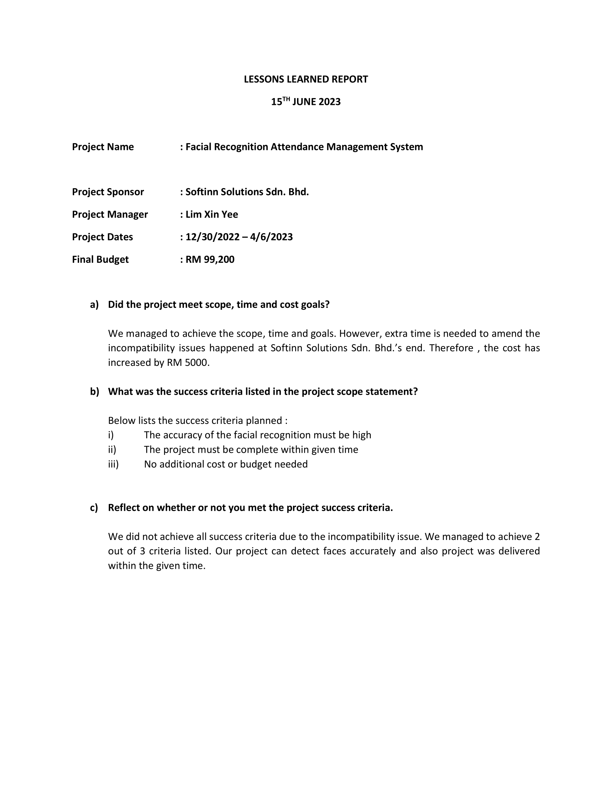
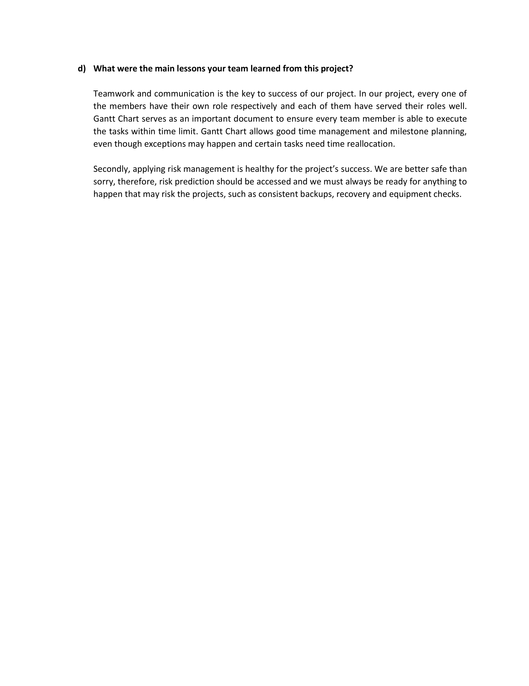
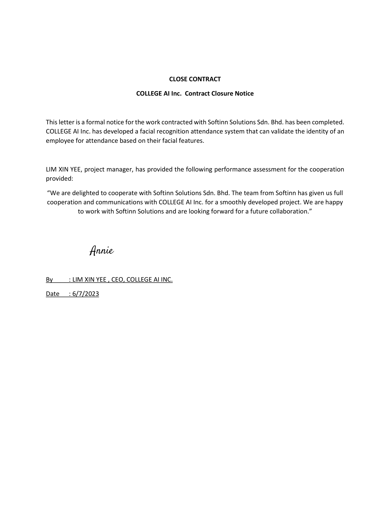

# PROJECT OVERVIEW

## E. COMPLETING THE PROJECT
### Closing Checklist
 

#### 1. Customer Acceptance Form

#### 2. Lessons Learned Document

#### 3. Final Project Report
**ATTENDANCE MANAGEMENT USING FACE RECOGNITION SYSTEM**

**1.0 PROJECT OBJECTIVES**

The attendance management using face recognition system done by College AI Inc. was intended to automate the traditional attendance system. Besides, one of the aims of College AI Inc. is to develop a system that are able to recognize a user by their facial features. Not only that, we also intend to develop an application programming interface (API) for the future ease of use as the integration module.

**2.0 SUMMARY OF PROJECT RESULTS**

After the system had been completed, then we tested the system. The result of accuracy for the current model is 99.38% accurate.

**3.0 ORIGINAL AND ACTUAL SCHEDULE**

The project member sticks to the Gantt chart scheduled so, the actual progress fits the original schedule.

**4.0 ORIGINAL AND ACTUAL BUDGET**

The actual budget matches the original budget, which means that the team has followed the budget planned at the beginning of the project and does not use any excessive money.

**5.0 PROJECT ASSESSMENT**

**5.1 SCOPE**

In modern society, facial recognition is becoming more popular. In the area of security, it has achieved significant advancements. It is a very useful tool that can assist law enforcement in identifying criminals, and software providers are utilizing the technology to make it easier for people to access the technology. This technology can be improved and utilized in several contexts, such as ATMs, secure file access and other sensitive information. Future projects based on facial detection and recognition can be built on the foundation of this project. Moreover, this project combines user-friendly UI with web development and database management. By using this system, any business, institution, or organization can replace the outdated method of monitoring staff attendance and produce a monthly report on their presence.
  

**5.2 OBJECTIVES**

College Ai Inc. managed to achieve the objectives initialized since the beginning of the project. A system that is artificial intelligence powered, which uses deep-learning technique has been made. Deep learning is able to produce astonishing results for face recognition which can get a good approximation of a complex function through the addition of hidden layers. It is a feature of machine language that instructs computers to perform tasks the way people naturally do them. As a result, deep learning is the method used in this system. Besides, FAST API is used to implement the python program that are used to perform "facial search" on images stored on the server in a Relational Database to get the top-k matches for all the faces in an input image. By using this method, our objective of building an API in the system was met.

**5.3 IMPACTS**

By creating this system, it can save time for both employees and admin. Face Recognition means no paperwork needed, which ultimately saves time and money and providing accurate data instantly. Besides, this system will help simplify payroll by keeping attendance data into the system, making it easy to get information and calculate attendance-based salaries at any time resulting in a simplified payroll process. Furthermore, Face recognition attendance system will eliminate fraud such as buddy punching.

**6.0 TRANSITION PLAN**

College AI Inc. staff will provide support when require. The main work of support provided by College AI Inc.’s staff on the attendance management using face recognition system project are as shown below:

i) Maintain the system

ii) Handling errors and updates of the system

iii) Provide user guidelines for Softinn Solutions Sdn. Bhd. staff to use the system

iv) Report information to senior management on monthly basis

#### 4. Close Contract

   
##### Next: [Project Presentation](F-PROJECT_PRESENTATION.md)

